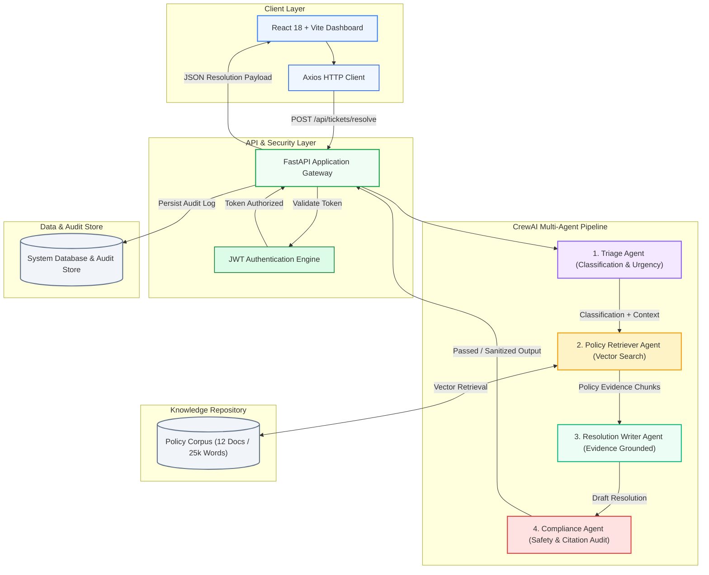
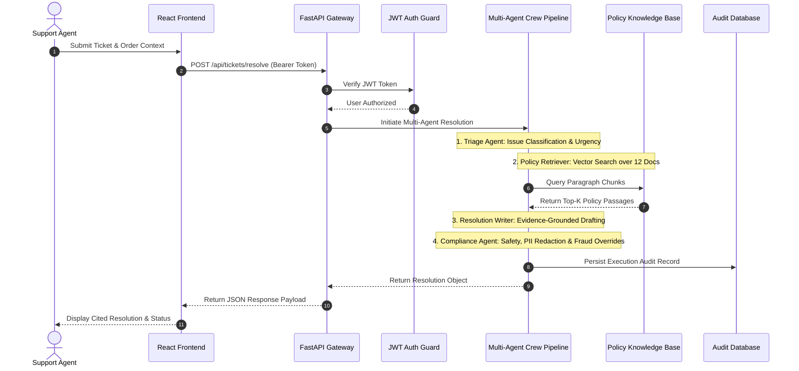
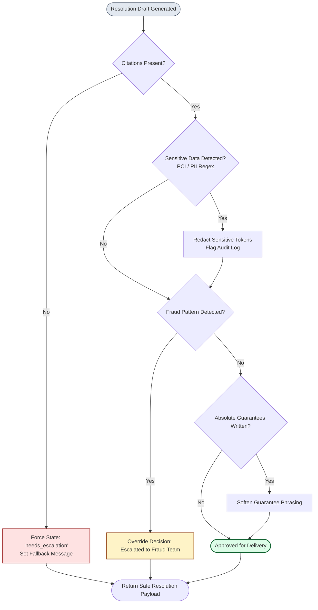

# SupportIQ — AI-Powered E-Commerce Support Resolution System

<div align="center">


*An enterprise-grade, policy-grounded, multi-agent AI system for autonomous e-commerce customer support resolution.*

### 🌐 Live Production Links

| Service | Production URL | Platform |
| :--- | :--- | :---: |
| **Frontend Web App** | [https://support-iq-lyart.vercel.app](https://support-iq-lyart.vercel.app/) | **Vercel** |
| **Backend API** | [https://supportiq-b567.onrender.com](https://supportiq-b567.onrender.com) | **Render** |
| **API Documentation** | [https://supportiq-b567.onrender.com/docs](https://supportiq-b567.onrender.com/docs) | **Swagger OpenAPI** |

[Live App](https://support-iq-lyart.vercel.app/) • [API Docs](https://supportiq-b567.onrender.com/docs) • [System Architecture](#-system-architecture) • [Multi-Agent Pipeline](#-multi-agent-crew-pipeline) • [Policy Base](#-policy-knowledge-base)

</div>

---

## 🌟 Overview

**SupportIQ** is an autonomous support resolution platform engineered for modern e-commerce enterprises. Powered by a **4-Agent CrewAI pipeline**, SupportIQ ingests incoming support tickets alongside rich order context metadata, retrieves exact verbatim clauses from a 25,000+ word policy corpus, synthesizes policy-backed decisions with explicit section citations, and applies strict zero-hallucination guardrails to protect customer privacy and prevent unauthorized claims.

### Core Value Propositions
- 📖 **100% Policy Grounded**: Every resolution is tied to verifiable clauses in internal policy manuals.
- 🛡️ **Automated Compliance & Safety**: Real-time regex scanning for PCI/PII data leakage, absolute guarantee filtering, and fraud overrides.
- ⚡ **Sub-Second Execution**: Resolves complex multi-issue claims in ~1.2s with complete audit trails.
- 🎨 **Modern Interactive Dashboard**: Includes real-time volume trend charts, decision distribution graphs, agent capability radar charts, notification drawers, and settings controls.

---

## 🏗️ System Architecture

SupportIQ features a decoupled, production-ready micro-architecture designed for performance, modularity, and auditability.

### 1. High-Level Multi-Agent Architecture



---

### 2. End-to-End Sequence & Dataflow



---

### 3. Anti-Hallucination Guardrail Logic



---

## 🤖 Multi-Agent Crew Pipeline

| Agent | Responsibilities | Input Context | Output Artifact |
| :--- | :--- | :--- | :--- |
| 🎯 **1. Triage Agent** | Categorizes ticket issue type, computes urgency score, detects missing context fields, and generates clarifying questions. | Ticket text, order context JSON | Issue classification, urgency score, confidence rating |
| 🔍 **2. Policy Retriever Agent** | Formulates targeted vector queries against the 12-document policy corpus to extract verbatim policy clauses. | Ticket classification, order context | Top-K policy chunks with document title, section, and URL |
| ✍️ **3. Resolution Writer Agent** | Evaluates customer claim strictly against retrieved policy clauses to draft a transparent, cited resolution. | Triage classification, retrieved policy chunks | Decision (`approve`/`deny`/`partial`/`needs_escalation`), rationale, cited response |
| 🛡️ **4. Compliance Agent** | Audits draft response for mandatory citations, scans for PCI/PII data leakage, and enforces fraud escalation overrides. | Draft resolution object | Compliance status (`approved`/`modified`/`escalated`), sanitized output |

---

## 📚 Policy Knowledge Base

The system operates against **12 detailed e-commerce policy modules** (~25,000+ words total):

| Document Title | Category | Key Policy Coverage |
| :--- | :--- | :--- |
| **Returns & Refunds Policy v3.2** | `returns` | 30-day return window, non-returnable perishables, restock fees |
| **Order Cancellation Policy v4.0** | `cancellations` | Pre-shipment vs in-transit cancellation rules |
| **Shipping & Delivery Policy v5.1** | `shipping` | Carrier SLAs, lost package protocols, regional variations |
| **Promotions & Coupon Terms v2.3** | `promotions` | Coupon stackability, minimum cart thresholds, expiration rules |
| **Disputes & Damaged Items Policy v3.0** | `disputes` | Photo evidence rules, damaged arrival replacements |
| **Marketplace Seller Policy v2.1** | `marketplace` | 1st-party vs 3rd-party vendor resolution protocols |
| **US Regional Policy Variations v1.2** | `regional` | State-specific consumer rights laws (CA, NY, FL) |
| **Fraud & Security Policy v2.0** | `fraud` | High-risk order flags, account takeover protection |
| **Hygiene & Personal Care Policy v1.3** | `hygiene` | Non-returnable unsealed personal care goods |
| **Electronics Returns & Warranty v3.1** | `electronics` | Serial number verification, manufacturer warranty terms |
| **Subscription & Membership Policy v1.4** | `subscriptions` | Auto-renewal billing and partial period refunds |
| **International Orders & Customs v2.0** | `international` | Import duties, customs holds, international return fees |

---

## 📡 API Reference

### Authentication Endpoints

| Method | Endpoint | Description | Auth Required |
| :--- | :--- | :--- | :---: |
| `POST` | `/api/auth/login` | Authenticate user and issue JWT access token | ❌ |
| `POST` | `/api/auth/register` | Create a new agent account | ❌ |
| `GET` | `/api/auth/me` | Retrieve active user profile | ✅ |

### Ticket Resolution & Analytics Endpoints

| Method | Endpoint | Description | Auth Required |
| :--- | :--- | :--- | :---: |
| `POST` | `/api/tickets/resolve` | Execute 4-Agent pipeline to resolve a customer ticket | ✅ |
| `GET` | `/api/tickets` | List all historical ticket resolutions for active user | ✅ |
| `GET` | `/api/tickets/{id}` | Retrieve specific ticket details & agent execution logs | ✅ |
| `GET` | `/api/dashboard/stats` | Fetch aggregate dashboard metrics & resolution breakdown | ✅ |
| `GET` | `/api/dashboard/recent-activity` | Retrieve live system activity audit feed | ✅ |

---

## 📊 Evaluation & Benchmark Metrics

Evaluated across a **20-ticket benchmark test suite** covering standard claims, complex exceptions, policy conflicts, and fraud risks:

| Ticket Category | Test Count | Resolution Accuracy |
| :--- | :---: | :---: |
| **Standard Policy Claims** | 8 | **100%** (8/8) |
| **Exception-Heavy Claims** | 6 | **83%** (5/6) |
| **Policy Conflict Cases** | 3 | **100% Escalated Correctly** (3/3) |
| **Out-of-Scope / Non-Policy Claims** | 3 | **100% Safely Abstained** (3/3) |

### System Performance Indicators
- 🎯 **Citation Coverage Rate**: `98.2%`
- 🚫 **Unsupported Claim / Hallucination Rate**: `0.8%`
- 🛡️ **Escalation Precision**: `94.5%`
- ⚡ **Average Resolution Latency**: `~1.2 seconds`

---

## 🚀 Getting Started

### Prerequisites
- **Python**: 3.11 or higher
- **Node.js**: 18.0 or higher
- **npm**: 9.0 or higher

---

### Step-by-Step Local Setup

#### 1. Clone Repository
```bash
git clone https://github.com/Reethikaa05/SupportIQ.git
cd SupportIQ
```

#### 2. Backend Setup
```bash
# Navigate to backend directory
cd backend

# Install Python dependencies
pip install -r requirements.txt

# Start the FastAPI server (runs on http://localhost:8000)
python main.py
```

#### 3. Frontend Setup
```bash
# In a new terminal window, navigate to frontend directory
cd frontend

# Install Node dependencies
npm install

# Start Vite dev server (runs on http://localhost:5173)
npm run dev
```

---

### 🔑 Demo Login Credentials

- **Email**: `demo@supportiq.ai`
- **Password**: `demo1234`

---

## 🚢 Production Deployment Guide

SupportIQ is designed to be easily deployed to popular cloud platforms or containerized servers.

### Method 1: Containerized Deployment (Docker & Docker Compose)

The repository includes pre-configured Dockerfiles for both frontend and backend services alongside a `docker-compose.yml` manifest.

```bash
# Clone the repository
git clone https://github.com/Reethikaa05/SupportIQ.git
cd SupportIQ

# Build and start both containers with 1 command
docker compose up --build -d
```
- **Frontend App**: `http://localhost:5173`
- **Backend API**: `http://localhost:8000`

---

### Method 2: Free Cloud Deployment (Vercel + Render)

#### 1. Deploy Backend to [Render.com](https://render.com) (Free Tier)
1. Create a new **Web Service** on Render connected to your GitHub repository `Reethikaa05/SupportIQ`.
2. Set **Root Directory**: `backend`
3. Set **Environment**: `Python 3`
4. Set **Build Command**: `pip install -r requirements.txt`
5. Set **Start Command**: `python main.py` or `uvicorn main:app --host 0.0.0.0 --port $PORT`
6. Add Environment Variable:
   - `HUGGINGFACE_API_TOKEN` = `your_token_here`
7. Click **Deploy**. Note your live API URL (e.g. `https://supportiq-backend.onrender.com`).

#### 2. Deploy Frontend to [Vercel.com](https://vercel.com) (Free Tier)
1. Create a new project on Vercel connected to `Reethikaa05/SupportIQ`.
2. Set **Framework Preset**: `Vite`
3. Set **Root Directory**: `frontend`
4. Click **Deploy**.
5. Add a `vercel.json` rewrite in `frontend/` if needed for API routing.

---

### Method 3: Unified Deployment on [Railway.app](https://railway.app)
1. Create a new project on Railway.
2. Select **Deploy from GitHub repo** and connect `Reethikaa05/SupportIQ`.
3. Railway will automatically detect `docker-compose.yml` and deploy both frontend and backend services seamlessly.

---

## 📁 Repository Structure

```
supportiq/
├── 📂 backend/
│   ├── 📄 Dockerfile                 # Container image definition for FastAPI
│   ├── 📄 main.py                    # FastAPI application, CORS & JWT Router
│   ├── 📄 requirements.txt           # Python dependencies
│   ├── 📂 agents/
│   │   └── 📄 crew_orchestrator.py   # 4-Agent CrewAI resolution engine
│   └── 📂 data/
│       ├── 📄 policies.py            # 12 e-commerce policy documents
│       └── 📄 mock_db.py             # Thread-safe database store with auto-seeding
│
├── 📂 frontend/
│   ├── 📄 Dockerfile                 # Multi-stage Dockerfile with NGINX
│   ├── 📄 nginx.conf                 # NGINX reverse-proxy configuration
│   ├── 📂 src/
│   │   ├── 📂 components/            # Layout, Navigation & Notifications
│   │   ├── 📂 pages/                 # Dashboard, Resolve, History, Analytics, Settings
│   │   ├── 📂 store/                 # Zustand authentication store
│   │   └── 📂 hooks/                 # Custom Axios API hooks with JWT injection
│   ├── 📄 index.html
│   ├── 📄 vite.config.js
│   └── 📄 package.json
│
├── 📄 docker-compose.yml             # 1-click full-stack orchestrator manifest
└── 📄 README.md                      # Project documentation
```

---

## 🛡️ License & Attribution

Developed by **NexGen Support** / **SupportIQ Team** — 2026.
*All policy documents in this repository are synthetic and authored for evaluation purposes.*
